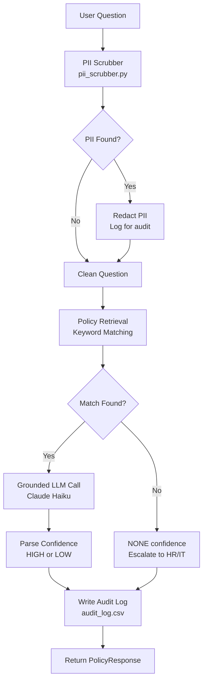
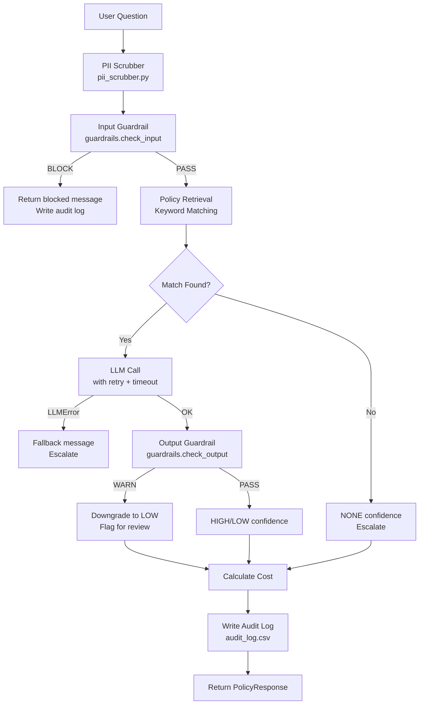

# Policy Pal — Agent & Developer Guide

## Project Overview

Policy Pal is an enterprise LLM demo that demonstrates four core patterns for
deploying AI safely in regulated environments:

1. **PII Scrubbing** — Regex-based redaction before any LLM call
2. **Grounded Responses** — LLM is constrained to only answer from loaded policy documents
3. **Confidence Scoring** — LLM self-assesses confidence; LOW triggers escalation
4. **Audit Logging** — Every query is logged to CSV with full context

## Architecture



## Project Structure

```
policy-pal/
├── policies/
│   ├── hr_policy.txt       # HR policies (vacation, remote work, expenses, reviews)
│   └── it_policy.txt       # IT policies (devices, security, data handling)
├── tests/
│   ├── test_pii_scrubber.py
│   ├── test_policy_engine.py
│   └── test_guardrails.py
├── pii_scrubber.py         # PII detection and redaction layer
├── guardrails.py           # Local Bedrock Guardrails analog (input/output checks)
├── policy_engine.py        # Core Q&A logic + observability + audit logging
├── compare_models.py       # Offline CLI: Haiku vs Sonnet side-by-side comparison
├── app.py                  # Streamlit UI
├── pyproject.toml          # uv project configuration
├── requirements.txt        # pip-compatible dependency list
├── .env.example            # Template for environment variables
└── AGENTS.md               # This file
```

## Pipeline Order



## Setup (using uv)

```bash
# 1. Install uv if not already installed
curl -LsSf https://astral.sh/uv/install.sh | sh

# 2. Create virtual environment and install dependencies
uv sync

# 3. Install dev dependencies (includes pytest)
uv sync --extra dev

# 4. Set your Anthropic API key
cp .env.example .env
# Edit .env and set ANTHROPIC_API_KEY=your_key_here
```

## Environment Variables

| Variable | Required | Default | Description |
|---|---|---|---|
| `ANTHROPIC_API_KEY` | Yes | — | Anthropic API key from console.anthropic.com |
| `SONNET_MODEL` | No | `claude-3-5-sonnet-20241022` | Model ID used by `compare_models.py` |
| `LLM_MAX_RETRIES` | No | `2` | Retry attempts on transient LLM errors |
| `LLM_REQUEST_TIMEOUT` | No | `30.0` | LLM call timeout in seconds |
| `GUARDRAIL_GROUNDING_THRESHOLD` | No | `0.25` | Min grounding score before WARN |
| `GUARDRAIL_RELEVANCE_THRESHOLD` | No | `0.15` | Min relevance score before WARN |
| `MAX_QUESTION_CHARS` | No | `2000` | Max input length before BLOCK |

All keys are loaded via `python-dotenv` from a `.env` file at the project root.
**Never commit `.env` to version control.**

## Running the App

```bash
# Run the Streamlit UI
uv run streamlit run app.py

# Run the CLI test (no UI required)
uv run python policy_engine.py

# Run Haiku vs Sonnet model comparison (offline, no Streamlit)
uv run python compare_models.py
```

## Running Tests

```bash
# Run all tests
uv run --with pytest pytest tests/ -v

# Run a specific test file
uv run --with pytest pytest tests/test_pii_scrubber.py -v
```

All tests run without requiring an API key — LLM-dependent paths are tested
via mocks.

## Adding New Policies

Drop any `.txt` file into `policies/`. The app and engine load all `.txt` files
automatically — no configuration needed.

## Key Design Decisions

- **No vector DB**: Retrieval uses keyword scoring to keep infrastructure at
  zero. In production, swap `find_relevant_policy()` for Bedrock Knowledge Bases.
- **PII never reaches the LLM**: `policy_engine.py` scrubs input _before_ the
  LLM call. The original question is stored only in the audit log.
- **Confidence from the model**: The prompt instructs the model to append
  `CONFIDENCE: HIGH` or `CONFIDENCE: LOW`, which is parsed from the response.
- **Type hints throughout**: All functions have explicit type annotations.

## Code Style

- Python 3.11+
- Type hints on all functions and variables
- `python-dotenv` for environment variable management
- `pytest` for testing (tests in `tests/` directory)
- uv for dependency management (`pyproject.toml`)
